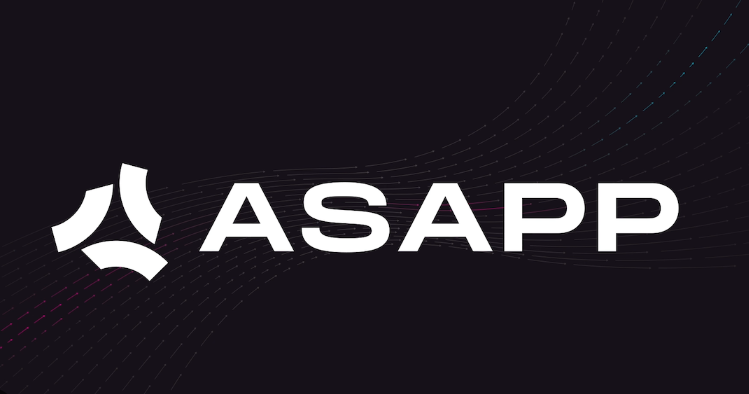

# Asapp-Lead-SDET-Challenge-API

<p align="center">
  
</p>

## Description

Asapp-Lead-SDET-Challenge-API was developed using Python, Pytest and Request library.

## Languages, libraries and tools used

* __[Python](https://www.python.org/downloads/)__
* __[Pytest](https://docs.pytest.org/en/6.2.x/getting-started.html)__
* __[Requests](https://docs.python-requests.org/en/master/)__
* __[Pycharm](https://www.jetbrains.com/pycharm/download/)__

Above Features are used to make code simple, generic, understandable, clean and easily maintainable for future development.

## Installation

Install the dependencies and start the testing.

 __Install Pytest__:
```sh
pip install -U pytest
```
 __Install Requests__:
```sh
pip install requests
```

## Automated tests

__To run a test, you can simply write the following command on Terminal__:
```sh
pytest
```

__To run and get details of all the executed test, you can simply write the following command on Terminal__:
```sh
pytest -rA
```

# Prerequisites
* __Python__
* __Any IDE__

# Built With

* __[Python](https://www.python.org/downloads/)__ - Language used to build the application.
* __[Pycharm](https://www.jetbrains.com/pycharm/download/)__ - The IDE for writing Automation Test Scripts
